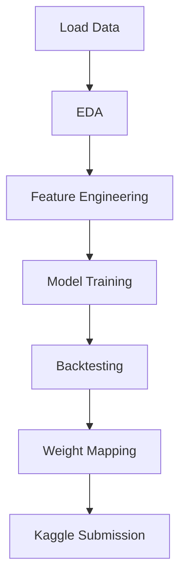

# CAU Machine Learning Project 4  
## Hull Tactical Market Prediction

This repository contains the full implementation for Project 4 of the Machine Learning course at Chung-Ang University. It includes the complete pipeline for solving the Hull Tactical Market Prediction problem—covering research, feature engineering, model development, backtesting, and Kaggle submission.
## ⚙️ Reproducibility Guide (Kaggle Environment)

This project was developed within the **Kaggle** platform, utilizing the proprietary competition dataset and inference API. To fully reproduce the analysis, models, and submission, you must follow these steps within a Kaggle Notebook environment.

### Prerequisites

1.  **Kaggle Account:** You must have a registered Kaggle account.
2.  **Competition Access:** Go to the [Hull Tactical Market Prediction Kaggle Competition Page](https://www.kaggle.com/competitions/hull-tactical-market-prediction/overview) and accept the competition rules to gain access to the required dataset.

### Step 1: Set up the Kaggle Notebook

1.  **Create a New Notebook:** Start a new Kaggle Notebook linked to the **Hull Tactical Market Prediction** competition. The dataset files (`train.csv`, `test.csv`) will be automatically mounted under the `/kaggle/input/` directory.
2.  **Ensure Libraries are Present:** The following core libraries are required. Most are pre-installed in the Kaggle environment:
    ```python
    import numpy as np
    import pandas as pd
    import lightgbm as lgb
    from sklearn.model_selection import TimeSeriesSplit
    import kaggle_evaluation.default_inference_server
    ```

### Step 2: Run the Research Notebook (`NotebookA_Research.ipynb`)

1.  Upload **`NotebookA_Research.ipynb`** to your Kaggle Notebook environment.
2.  Run all cells sequentially. This notebook executes the entire development pipeline:
    * **EDA** and **Feature Engineering** (Lags, Rolling Features).
    * Training and evaluation of the **Momentum** and **Random Forest Baselines**.
    * **Time-Series Cross-Validation** (CV) and backtesting of the final LightGBM model.
    * **Generates the final `submission.csv`** file in the required format.

### Step 3: Run the Inference Notebook for Submission (`NotebookB_Inference.ipynb`)

1.  Create a **second, separate Kaggle Notebook**. This separation mimics the actual Kaggle submission environment.
2.  **CRITICAL SETTING:** Ensure the **Internet is Disabled** for this notebook session. Kaggle submissions typically prohibit external network access.
3.  Upload **`NotebookB_Inference.ipynb`** to this new notebook.
4.  This notebook handles the final deployment logic:
    * It trains the **final LightGBM model** (using the configuration determined in `NotebookA`).
    * It defines the required `predict(data)` function.
    * It initializes and runs the `kaggle_evaluation.default_inference_server` to enable scoring against the private test set.

**To Submit:** Once the **`NotebookB_Inference.ipynb`** is run and committed **with the Internet Disabled**, use the "Submit" option on the Kaggle platform to generate your final leaderboard score.

---

#  Project Structure

```
CAU-ML-PROJECT4/
├── notebooks/
│   ├── NotebookA_Research.ipynb        # EDA, FE, model training, backtesting
│   └── NotebookB_Inference.ipynb       # Kaggle submission notebook
│
├── report/
│   └── ML_Project4_Report.pdf
│
├── submissions/
│   └── submission.csv                  # Kaggle-ready submission
│
│
└── README.md
```

---

# 1. Project Overview

- Predict S&P 500 market-forward excess returns  
- Convert predictions → portfolio weights in [0, 2]  
- Satisfy volatility constraint: strategy_vol ≤ 1.2 × benchmark_vol  
- Build a clean, reproducible ML pipeline for Kaggle

---

# 2. Exploratory Data Analysis (Notebook A)

- Feature-group inspection: D, E, I, M, P, S, V  
- Missing value structure  
- Target distribution  
- Long-term return behavior  
- Regime transitions  

---

# 3. Baseline Models

| Model | MSE | RMSE | MAE | Direction Accuracy |
|-------|--------|--------|--------|---------------------|
| Momentum (5-day) | 0.000136 | 0.01166 | 0.008368 | 48.14% |
| Random Forest | 0.000126 | 0.011207 | 0.007943 | 48.06% |

---

# 4. Feature Engineering

- Lag returns (1–5 days)  
- Rolling means (5, 21)  
- Volatility  
- Drawdown magnitude  
- High-volatility indicator  
- Sharpe-like metric  

---

# 5. LightGBM Model

Time-Series CV Results:

| Fold | MSE | RMSE | MAE |
|------|-----------|-----------|-----------|
| 1 | 0.000157 | 0.012539 | 0.009654 |
| 2 | 0.000118 | 0.010873 | 0.008075 |
| 3 | 0.000208 | 0.014435 | 0.010636 |
| 4 | 0.000085 | 0.009206 | 0.006910 |
| 5 | 0.000163 | 0.012770 | 0.009117 |

Avg CV RMSE ≈ 0.0120

---

# 6. Backtesting Results

**Volatility**  
- Strategy: 0.013341  
- Benchmark: 0.011117  
- Ratio: 1.200  

**Drawdowns**  
- Strategy: −0.3856  
- Benchmark: −0.3258  

---

# 7. Final LightGBM Configuration

```
learning_rate: 0.05
n_estimators: 900
num_leaves: 100
max_depth: 10
objective: regression
metric: rmse
n_jobs: -1
random_state: 42
```

---

# 8. Portfolio Weight Mapping

- tanh normalization  
- shift to positive  
- clip to [0, 2]  

---

# 9. Volatility Constraint

strategy_vol / benchmark_vol ≤ 1.2  
Final ratio achieved: 1.200

---

# 10. Kaggle Submission

Generates:  
- submission.csv  

---

# 11. Final Results Summary

| Metric | Value |
|--------|-------|
| RMSE | 0.013119 |
| MAE | 0.009543 |
| Direction Accuracy | 49.09% |
| Volatility Ratio | 1.200 |
| Sharpe-like | 0.0121 |
| Max Drawdown | −0.3856 |

---

# Flowchart


